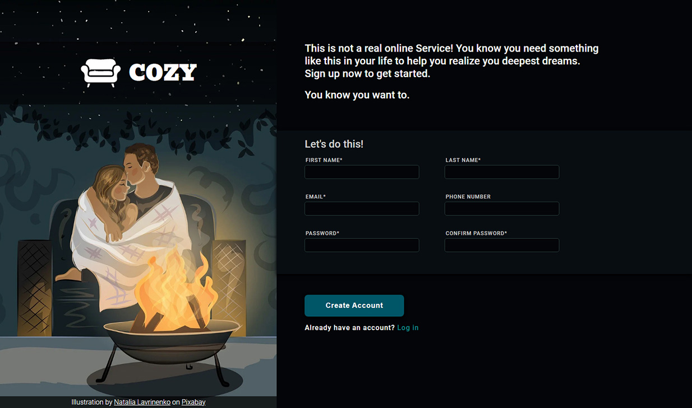

# Sign-up Form

## About

---

This is my submission for [The Odin Project](https://www.theodinproject.com/) Sign-up Form, part of the [Intermediate HTML and CSS Course](https://www.theodinproject.com/paths/full-stack-javascript/courses/intermediate-html-and-css).

-   [Try the Sign-Up here](https://madmaia3d.github.io/odin-sign-up-form/)
-   [Link to the Assignment](https://www.theodinproject.com/lessons/node-path-intermediate-html-and-css-sign-up-form)

## Goal

---

The main objective of this project is to learn how to use HTML forms, pre-validate and stylize it with CSS.

## Languages

---

-   HTML 5
-   CSS

## Tools Used

---

-   Visual Studio Code
-   Git
-   Inkscape

## Resources Used

---

-   [Google Fonts](https://fonts.google.com/)
-   [Font Awesome](https://fontawesome.com/)
-   [Pixabay](https://pixabay.com/pt/) (illustration)
